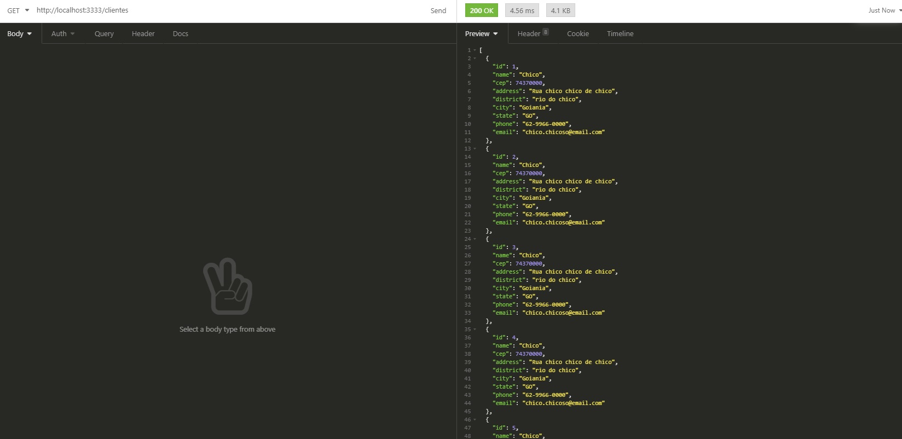
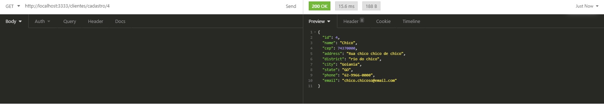
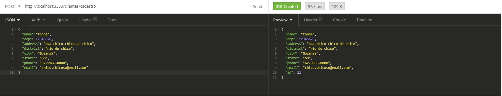

pt-br,

## Instruções

`yarn install` 
 para instalar todas as dependências. 

`yarn dev` 
 Start no backend em localhost: 3333 

 Você pode usar o insominia para postar, se o frontend não for iniciado 

 Para ver os dados no banco de dados, use o beekeeper Studio 

### Nota

 Criei este backend usando typescript, já havia feito 2 projetos antes que envolvem typescript no back end, achei mais útil usá-lo para melhor desempenho do tempo que tenho para realizar o teste. 

  Obrigado,

 

en-us,

## Instructions

`yarn install` 
 for install all dependencies.

`yarn dev` 
 Run backend in localhost: 3333 

Can u use insominia for post, if the frontend isnt start 

For see data in database, use beekeeper Studio

### Note

I created this backend using typescript, I had already done 2 projects before that involve typescript in the back end, I found it more useful to use it for better performance of the time I have to perform the test. 

  thx,

### Prints

<h4>Update</h4>
[ ] - Longitude, latitude
[ ] - usuário marcar a localização nele me uma libs de mapa.
